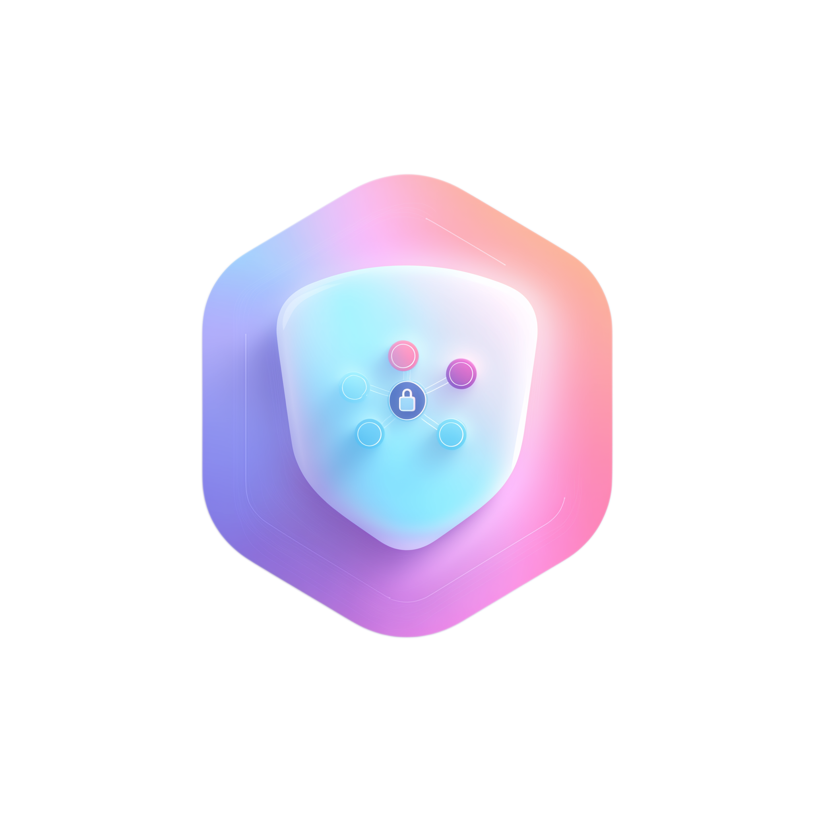

  

<h1 align="center">awesome-agentic-hardening</h1>

  🛡️ A curated list of tools, papers, frameworks, and best practices for hardening agentic AI systems.

  
  
  
  
  
  

  Covering prompt injection defense, runtime sandboxing, protocol security, red teaming, and governance standards.

---

## Why This List?

Agentic AI systems — LLM-powered agents that autonomously use tools, access data, and coordinate with other agents — introduce an entirely new class of security risks beyond traditional LLM vulnerabilities. This curated list organizes resources along the **"Attack Surface → Hardening Techniques → Evaluation & Testing → Governance & Standards"** pipeline, so whether you approach from a red team or blue team perspective, you can quickly find what you need.

The taxonomy aligns with three authoritative sources:

| Source | Coverage |
|--------|----------|
| [OWASP Agentic Top 10 (2026)](https://genai.owasp.org/) | All ASI01–ASI10 risk items |
| [arXiv Academic Surveys](https://arxiv.org/html/2510.23883v2) | 5 threat categories + 4 defense categories |
| NIST / McKinsey / CSA Governance Frameworks | Full governance coverage |

## Contents

- [Threat Landscape](#threat-landscape)
  - [Prompt Injection & Jailbreaks](#1-prompt-injection--jailbreaks)
  - [Tool Misuse & Autonomous Exploitation](#2-tool-misuse--autonomous-exploitation)
  - [Memory & Context Poisoning](#3-memory--context-poisoning)
  - [Multi-Agent & Protocol-Level Threats](#4-multi-agent--protocol-level-threats)
  - [Identity, Privilege & Supply Chain Risks](#5-identity-privilege--supply-chain-risks)
- [Hardening Techniques](#hardening-techniques)
  - [Prompt Hardening & Input Sanitization](#6-prompt-hardening--input-sanitization)
  - [Runtime Sandboxing & Capability Confinement](#7-runtime-sandboxing--capability-confinement)
  - [Detection, Monitoring & Observability](#8-detection-monitoring--observability)
  - [Multi-Agent Security & Protocol Hardening](#9-multi-agent-security--protocol-hardening)
- [Evaluation & Testing](#evaluation--testing)
  - [Red Teaming & Benchmarks](#10-red-teaming--benchmarks)
  - [Datasets & Reproducible Research](#11-datasets--reproducible-research)
- [Governance & Standards](#governance--standards)
  - [Frameworks, Standards & Compliance](#12-frameworks-standards--compliance)
- [Contributing](#contributing)

---

## Threat Landscape

> *Know Your Enemy — Understanding the attack surfaces of agentic AI systems.*

### 1. Prompt Injection & Jailbreaks

Covers direct prompt injection (DPI), indirect prompt injection (IPI), multimodal injection (image/audio/video embedded instructions), multilingual obfuscation injection, payload splitting, and more.

<!-- prettier-ignore -->
| Resource | Type | Description |
|----------|------|-------------|
| [Agentic AI Security: Threats, Defenses, Evaluation, and Open Challenges](https://arxiv.org/abs/2510.23883) | 📄 Paper | Comprehensive survey covering a taxonomy of agentic AI threats (prompt injection, tool misuse, memory poisoning, etc.), defense strategies, and evaluation methodologies. (UC Davis, arXiv 2025) |

[Back to top ↑](#contents)

### 2. Tool Misuse & Autonomous Exploitation

Covers unauthorized tool invocation, autonomous vulnerability exploitation (one-day CVE exploitation), SQL injection chains, code execution escapes, and more.

<!-- prettier-ignore -->
| Resource | Type | Description |
|----------|------|-------------|
| _Coming soon_ | | |

[Back to top ↑](#contents)

### 3. Memory & Context Poisoning

Covers long-term memory poisoning, RAG data contamination, and session context tampering.

<!-- prettier-ignore -->
| Resource | Type | Description |
|----------|------|-------------|
| _Coming soon_ | | |

[Back to top ↑](#contents)

### 4. Multi-Agent & Protocol-Level Threats

Covers MCP (Model Context Protocol) and A2A (Agent-to-Agent) protocol-level attacks, including rogue agent registration, cross-agent transitive injection, coordination manipulation, and communication channel poisoning.

<!-- prettier-ignore -->
| Resource | Type | Description |
|----------|------|-------------|
| [MCP Safety Audit](https://github.com/johnhalloran321/mcpSafetyScanner) | 🔧 Tool | First agentic auditing tool for MCP server security. Demonstrates that MCP design enables major exploits including malicious code execution, remote access control, and credential theft. Includes MCPSafetyScanner. (arXiv 2025) |

[Back to top ↑](#contents)

### 5. Identity, Privilege & Supply Chain Risks

Covers non-human identity (NHI) management, privilege abuse, credential theft, and supply chain poisoning.

<!-- prettier-ignore -->
| Resource | Type | Description |
|----------|------|-------------|
| _Coming soon_ | | |

[Back to top ↑](#contents)

---

## Hardening Techniques

> *Proactive defense — Reducing the attack surface of your agentic systems.*

### 6. Prompt Hardening & Input Sanitization

Covers prompt hardening engineering, input/output filtering, instruction isolation, sandwich defense, XML/Markdown delimiter strategies, paraphrase-based detection, and more.

<!-- prettier-ignore -->
| Resource | Type | Description |
|----------|------|-------------|
| [MCP-Guard](https://arxiv.org/abs/2508.10991) | 📦 Framework | Multi-stage defense-in-depth framework for securing MCP-based LLM-tool interactions. Three-stage pipeline: static scanning → deep neural detection → LLM arbitration. Achieves 96.01% accuracy. Includes MCP-ATTACKBENCH (70,448 samples). (arXiv 2025) |

[Back to top ↑](#contents)

### 7. Runtime Sandboxing & Capability Confinement

Covers runtime sandboxing, least-privilege tool invocation, and capability-based access control.

<!-- prettier-ignore -->
| Resource | Type | Description |
|----------|------|-------------|
| _Coming soon_ | | |

[Back to top ↑](#contents)

### 8. Detection, Monitoring & Observability

Covers behavioral anomaly detection, tool call chain auditing, agent behavior profiling, and real-time intent monitoring.

<!-- prettier-ignore -->
| Resource | Type | Description |
|----------|------|-------------|
| _Coming soon_ | | |

[Back to top ↑](#contents)

### 9. Multi-Agent Security & Protocol Hardening

Covers protocol-level hardening (MCP/A2A authentication & encryption), agent identity verification, cross-agent trust chain management, and communication channel integrity checks.

<!-- prettier-ignore -->
| Resource | Type | Description |
|----------|------|-------------|
| [G-Safeguard](https://github.com/wslong20/G-safeguard) | 🔧 Tool | Topology-guided security framework for LLM-based multi-agent systems. Uses graph neural networks to detect anomalies on multi-agent utterance graphs and topological intervention for attack remediation. Recovers over 40% performance under prompt injection. (arXiv 2025) |

[Back to top ↑](#contents)

---

## Evaluation & Testing

> *Measure and validate — Ensuring your defenses actually work.*

### 10. Red Teaming & Benchmarks

Covers security evaluation benchmarks (e.g., AgentHarm, InjectAgent, ASB), red team tools, and adversarial testing frameworks.

<!-- prettier-ignore -->
| Resource | Type | Description |
|----------|------|-------------|
| [AgentDojo](https://github.com/ethz-spylab/agentdojo) | 🔧 Tool | Dynamic evaluation framework for testing prompt injection attacks and defenses on tool-calling LLM agents. 97 tasks, 629 security test cases. (ETH Zurich, NeurIPS 2024) |
| [InjecAgent](https://github.com/uiuc-kang-lab/InjecAgent) | 📊 Dataset | Benchmark for indirect prompt injection in tool-integrated LLM agents. 1,054 test cases across 17 user tools and 62 attacker tools. (UIUC, ACL 2024 Findings) |
| [Agent Security Bench (ASB)](https://github.com/agiresearch/ASB) | 📦 Framework | Comprehensive framework formalizing and benchmarking attacks/defenses for LLM agents. 10 scenarios, 10 agents, 400+ tools, 27 attack/defense methods, 7 metrics. Highest avg ASR of 84.30%. (Rutgers, ICLR 2025) |

[Back to top ↑](#contents)

### 11. Datasets & Reproducible Research

Covers publicly available attack/defense datasets, reproducible experiments, and CTF challenge resources.

<!-- prettier-ignore -->
| Resource | Type | Description |
|----------|------|-------------|
| _Coming soon_ | | |

[Back to top ↑](#contents)

---

## Governance & Standards

> *Institutional guardrails — Policies, standards, and compliance frameworks.*

### 12. Frameworks, Standards & Compliance

Covers OWASP Agentic Top 10, NIST AI RMF Overlays, Microsoft NIST-based Governance Framework, CSA AAGATE Platform, McKinsey Agentic AI Governance Handbook, and more.

<!-- prettier-ignore -->
| Resource | Type | Description |
|----------|------|-------------|
| [OWASP Top 10 for Agentic Applications (2026)](https://genai.owasp.org/resource/owasp-top-10-for-agentic-applications-for-2026/) | 📋 Standard | Peer-reviewed framework identifying the 10 most critical security risks (ASI01–ASI10) for autonomous AI agents. Developed by 100+ experts. |

[Back to top ↑](#contents)

---

## Contributing

Contributions are welcome! Please read our [Contributing Guidelines](CONTRIBUTING.md) before submitting a pull request.

Please also check out our [Code of Conduct](CODE_OF_CONDUCT.md).

## License

This work is licensed under [CC0 1.0 Universal](LICENSE).
